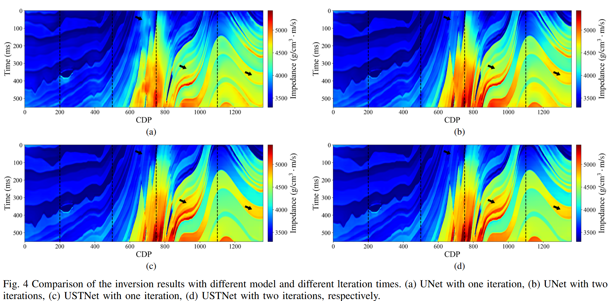

## 🧠 Iterative Gradient Corrected Semi-Supervised Seismic Impedance Inversion via Swin Transformer

### 📄 Abstract

Seismic impedance inversion is essential for subsurface exploration, facilitating precise lithological interpretation by reconstructing subsurface impedance. Although recent deep learning-based methods have advanced this field, many rely on direct mapping from observation to model space, which increases solution uncertainty due to the presence of a large null space, impacting inversion accuracy.

To address this issue, we propose an iterative method that operates within the model space, applying progressive gradient correction to incrementally refine the current model toward a physically plausible solution, effectively reducing non-uniqueness and improving inversion robustness compared to single-step updates.

This iterative framework is enhanced by a semi-supervised learning strategy, leveraging both architecture and loss design. While most DL methods use convolutional networks, their localized nature limits long-range feature extraction. To overcome this, we introduce **USTNet**, a hybrid UNet–Swin Transformer architecture, which captures multi-scale features and enhances inversion accuracy. Structural priors are incorporated into the loss function to maintain geological coherence.

Experiments on synthetic and field datasets demonstrate that our method significantly outperforms conventional and state-of-the-art deep learning approaches in inversion accuracy.

---

## 📊 Some Results

### 🖼️ Inversion Result Example

  

